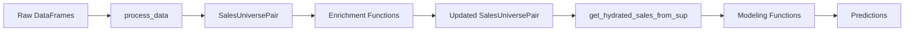

## SalesUniversePair

The **SalesUniversePair** is the fundamental data structure in OpenAVM Kit. Nearly every function in the library operates on or returns this structure.

<Info>
Defined in `openavmkit/data.py:96`, SalesUniversePair is a Python dataclass that bundles together two related DataFrames that need to be processed in tandem.
</Info>

### Structure definition

```python
@dataclass
class SalesUniversePair:
    sales: pd.DataFrame
    universe: pd.DataFrame
```

### The two DataFrames

<Accordion title="Sales DataFrame">
**Purpose:** Contains transaction records with known sale prices

**Key characteristics:**
- Represents transactions and any known data at the time of the transaction
- Allows **duplicate parcel keys** since a parcel may have sold multiple times
- Each row has a unique `key_sale` identifier
- Used for training and validating predictive models

**Required fields:**
- `key_sale` - Unique transaction identifier
- `key` - Parcel identifier (can appear multiple times)
- `sale_price` - Transaction price
- `sale_date` - When the transaction occurred
- `valid_sale` - Boolean indicating if sale should be used for modeling
- `vacant_sale` - Boolean indicating if parcel was vacant at time of sale
</Accordion>

<Accordion title="Universe DataFrame">
**Purpose:** Contains the current state of all parcels in the jurisdiction

**Key characteristics:**
- Represents the current state of all parcels
- **Forbids duplicate parcel keys** - each parcel appears exactly once
- Each row has a unique `key` identifier
- This is the dataset we generate predictions for

**Required fields:**
- `key` - Unique parcel identifier
- `is_vacant` - Boolean indicating current vacancy status
- `model_group` - Classification (residential, commercial, etc.)
- Various characteristics (land area, building area, zoning, etc.)
</Accordion>

### Why this structure exists

The SalesUniversePair structure is necessary because:

1. **Consistency:** Sales and universe data need to be processed together to ensure consistency in field calculations, transformations, and enrichments

2. **Historical context:** Sales represent historical transactions with characteristics at the time of sale, while universe represents current parcel state

3. **Overlays:** The sales DataFrame acts as an "overlay" on the universe, containing only transaction-specific information without duplicating parcel characteristics

<Note>
Many functions "hydrate" sales by merging them with universe data. This combines the transaction information with the full parcel characteristics.
</Note>

## Key operations

### Creating a SalesUniversePair

```python
from openavmkit.data import SalesUniversePair

sup = SalesUniversePair(
    sales=df_sales,
    universe=df_universe
)
```

### Accessing DataFrames

```python
# Dictionary-style access
sales_df = sup["sales"]
universe_df = sup["universe"]

# Attribute access
sales_df = sup.sales
universe_df = sup.universe
```

### Modifying DataFrames

<Accordion title="Using set()">
Replace an entire DataFrame:

```python
sup.set("sales", new_sales_df)
sup.set("universe", new_universe_df)
```
</Accordion>

<Accordion title="Using update_sales()">
Update sales DataFrame as an overlay without redundancy:

```python
sup.update_sales(
    new_sales=df_with_new_fields,
    allow_remove_rows=False
)
```

This function:
- Preserves existing fields from the original sales DataFrame
- Adds only new fields generated in the update
- Avoids duplicating information already in universe
- Optionally filters rows based on `allow_remove_rows`
</Accordion>

<Accordion title="Using copy()">
Create a deep copy of the entire structure:

```python
sup_copy = sup.copy()
```
</Accordion>

### Hydrating sales data

The `get_hydrated_sales_from_sup()` function merges sales and universe data:

```python
from openavmkit.data import get_hydrated_sales_from_sup

df_hydrated = get_hydrated_sales_from_sup(sup)
```

**What it does:**
1. Takes the universe DataFrame and filters to parcels that have sales
2. Merges universe data with sales data
3. Sales data overrides universe data where conflicts exist
4. Returns a GeoDataFrame if geometry is present

<Info>
This creates a "complete" sales DataFrame with all parcel characteristics at the time of sale.
</Info>

## Related data structures

### TimingData

Used internally to track performance metrics during data processing.

### TreeBasedCategoricalData

Stores categorical variable encodings for tree-based machine learning models.

### Model result structures

Various model classes return structured results containing:
- Trained model objects
- Predictions
- Performance metrics
- Feature importance
- SHAP values (for tree-based models)

## Data flow through the pipeline



## Best practices

<Accordion title="Keep sales as an overlay">
Don't duplicate universe fields in sales unless they differ at time of sale. Let hydration merge them when needed.
</Accordion>

<Accordion title="Use update_sales() for incremental changes">
When adding new calculated fields to sales, use `update_sales()` rather than `set()` to maintain the overlay structure.
</Accordion>

<Accordion title="Validate keys">
Ensure universe has unique keys and sales has valid `key` references to universe parcels.

```python
# Check for duplicate keys in universe
assert len(df_universe["key"].unique()) == len(df_universe)

# Check that all sales reference valid parcels
assert df_sales["key"].isin(df_universe["key"]).all()
```
</Accordion>

<Accordion title="Handle geometry carefully">
If working with spatial data, ensure both DataFrames are GeoDataFrames with consistent CRS:

```python
import geopandas as gpd

if isinstance(sup.universe, gpd.GeoDataFrame):
    print(f"CRS: {sup.universe.crs}")
```
</Accordion>

## Common patterns

### Pattern: Process both DataFrames

Many functions need to apply the same operation to both sales and universe:

```python
def process_both(sup: SalesUniversePair, settings: dict) -> SalesUniversePair:
    for key in ["sales", "universe"]:
        df = sup[key]
        # Process df...
        sup.set(key, df)
    return sup
```

### Pattern: Filter sales to keys

```python
# Keep only specific sales
sup.limit_sales_to_keys(list_of_valid_keys)
```

### Pattern: Get training/test split

```python
from openavmkit.data import get_train_test_keys

df_hydrated = get_hydrated_sales_from_sup(sup)
train_keys, test_keys = get_train_test_keys(df_hydrated, settings)

df_train = df_hydrated[df_hydrated["key_sale"].isin(train_keys)]
df_test = df_hydrated[df_hydrated["key_sale"].isin(test_keys)]
```