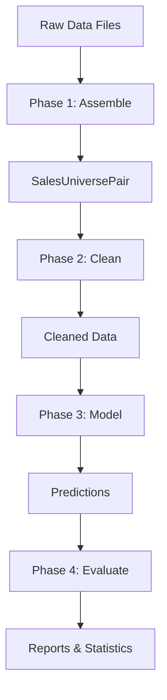

## Overview

OpenAVM Kit follows a structured, multi-phase workflow for mass appraisal. Each phase builds upon the previous one, transforming raw data into accurate property valuations.

<Info>
The workflow is implemented through a series of Jupyter notebooks in the `notebooks/pipeline/` directory, each corresponding to a phase of the process.
</Info>

## The four-phase workflow

### Phase 1: Assemble

**Goal:** Load and merge raw data into a unified structure

<Accordion title="What happens in the assemble phase">
This phase takes your raw data files and combines them into the core data structure used throughout OpenAVM Kit:

1. **Load dataframes** from various sources (parcels, sales, characteristics)
2. **Merge data** according to instructions in `settings.json`
3. **Create SalesUniversePair** - the fundamental data structure containing:
   - Universe: all parcels in your jurisdiction
   - Sales: transactions with known prices
4. **Enrich data** with calculated fields, spatial joins, and external data sources
5. **Tag model groups** to classify parcels by type (residential, commercial, etc.)

**Output:** `1-assemble-sup.pickle` - the assembled and enriched data
</Accordion>

**Key functions:**
- `load_dataframes(settings)` - Load raw data
- `process_dataframes(dataframes, settings)` - Merge and enrich
- `tag_model_groups_sup(sup, settings)` - Classify parcels

### Phase 2: Clean

**Goal:** Validate and clean data for modeling

<Accordion title="What happens in the clean phase">
This phase ensures data quality and removes invalid or problematic records:

1. **Process sales data:**
   - Filter invalid sales (bad dates, prices, etc.)
   - Apply time adjustments to normalize sale prices
   - Validate sales within acceptable date ranges

2. **Sales scrutiny analysis:**
   - Run heuristics to identify suspicious sales
   - Perform cluster-based outlier detection
   - Remove manually flagged exclusions

3. **Data enrichment:**
   - Add spatial lag features (neighborhood effects)
   - Calculate street network metrics (frontage, depth)
   - Fill unknown values with defaults

4. **Split data:**
   - Divide sales into training (80%) and test (20%) sets
   - Ensure splits are stratified by model group

**Output:** `2-clean-sup.pickle` - validated and ready-to-model data
</Accordion>

**Key functions:**
- `process_sales(sup, settings)` - Clean and validate sales
- `run_sales_scrutiny(sup, settings)` - Identify outliers
- `enrich_sup_spatial_lag(sup, settings)` - Add neighborhood effects
- `fill_unknown_values_sup(sup, settings)` - Handle missing data

### Phase 3: Model

**Goal:** Train predictive models and generate valuations

<Accordion title="What happens in the model phase">
This is where machine learning models are trained to predict property values:

1. **Variable testing:**
   - Test which characteristics are most predictive
   - Evaluate individual feature importance

2. **Model training:**
   - **Main models** - predict full market value for improved parcels
   - **Vacant models** - predict land value using vacant land sales
   - **Hedonic models** - predict land value by simulating vacancy
   - **Ensemble models** - combine multiple model predictions

3. **Model types available:**
   - XGBoost (gradient boosting)
   - LightGBM (gradient boosting)
   - CatBoost (gradient boosting)
   - GWR (geographically weighted regression)
   - MRA (multiple regression analysis)
   - And more...

4. **Generate predictions:**
   - Train on training set
   - Validate on test set
   - Predict values for entire universe

**Output:** Model files, predictions, and performance metrics in `out/models/`
</Accordion>

**Key functions:**
- `try_variables(sup, settings)` - Test feature importance
- `try_models(sup, settings)` - Experiment with models quickly
- `run_models(sup, settings)` - Final model training and prediction

### Phase 4: Evaluate

**Goal:** Assess model performance and generate reports

<Accordion title="What happens in the evaluate phase">
This phase measures how well your models performed:

1. **Ratio studies:**
   - Calculate assessment ratios (predicted / actual)
   - Compute standard metrics (COD, PRD, PRB)
   - Break down by location, value ranges, model groups

2. **Equity studies:**
   - **Horizontal equity** - similar properties assessed similarly
   - **Vertical equity** - proportional assessment across value ranges

3. **Generate reports:**
   - PDF reports with statistics and visualizations
   - Excel exports with detailed breakdowns
   - Scatter plots and diagnostic charts

4. **Quality control:**
   - Identify problematic predictions
   - Flag potential outliers
   - Review model assumptions

**Output:** Reports, statistics, and visualizations in `out/`
</Accordion>

**Key functions:**
- `RatioStudy(df, settings)` - Assessment ratio analysis
- `HorizontalEquityStudy(df, settings)` - Horizontal equity analysis
- `VerticalEquityStudy(df, settings)` - Vertical equity analysis

## Data flow diagram



## Iterative refinement

<Note>
The workflow is designed to be iterative. You'll often cycle back through phases as you:
- Discover data quality issues requiring cleanup
- Test different modeling approaches
- Refine settings based on evaluation results
- Add new data sources or features
</Note>

## Checkpointing and caching

OpenAVM Kit uses checkpointing to save progress between phases:

- Each phase saves its output as a `.pickle` file
- Intermediate results can be cached to speed up re-runs
- You can jump into any phase by loading the previous phase's checkpoint

**Example:**
```python
# Load cleaned data to skip straight to modeling
sup = read_pickle("out/2-clean-sup")
```

## Best practices

<Accordion title="Start small">
Begin with a subset of your data to validate the workflow before processing your entire jurisdiction.
</Accordion>

<Accordion title="Document settings">
Keep detailed notes about what settings and parameters work best for your locality.
</Accordion>

<Accordion title="Validate early and often">
Run evaluation metrics during the model phase, not just at the end. This helps catch issues earlier.
</Accordion>

<Accordion title="Use version control">
Track changes to your `settings.json` and document why you made specific configuration choices.
</Accordion>